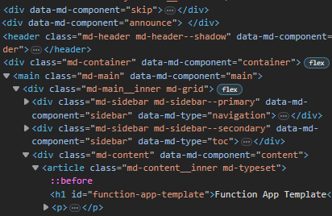
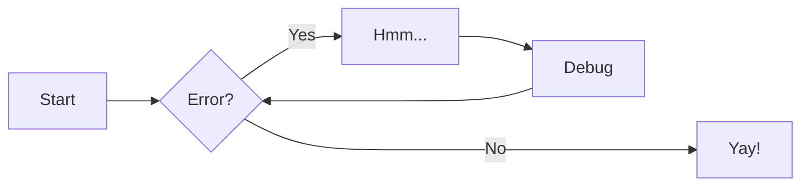

# Feature testing

## Screenshots

A screenshot 😀

## Diagrams

## Project layout

  mkdocs.yml    # The configuration file.
  docs/
      index.md  # The documentation homepage.
      ...       # Other markdown pages, images and other files.

## Video

This section is testing basic MP4 playing functionality

### Video referenced with markdown image format 

(doesnt work)

### Video referenced with &lt;video&gt; tags

<video width="400" controls>
  <source src="./content/vid.mp4" type="video/mp4">
</video>

### LFS Video referenced by content URL

LFS content works with a workaround, but I have removed content because when creating a new repository from a template, the LFS content is not accessible from the new repository.

### Gifs

<iframe src="https://racwa-my.sharepoint.com/personal/bryce_thompson_rac_com_au/_layouts/15/embed.aspx?UniqueId=a341532f-87be-4c26-979f-66298b8487b7&embed=%7B%22ust%22%3Atrue%2C%22hv%22%3A%22CopyEmbedCode%22%7D&referrer=StreamWebApp&referrerScenario=EmbedDialog.Create" width="640" height="360" frameborder="0" scrolling="no" allowfullscreen title="Media1.mp4"></iframe>
